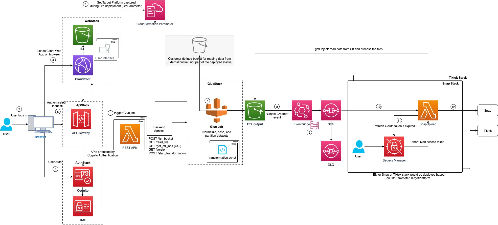

# Audience Uploader from AWS Clean Rooms

> [!WARNING]
> **THIS AWS SOLUTION IS NO LONGER MAINTAINED**

## Table of Contents

- [Solution Overview](#solution-overview)
- [Architecture for Audience Uploader from AWS Clean Rooms](#architecture)
- [AWS CDK Constructs](#aws-cdk-constructs)
- [Deployment](#deployment)
- [Creating a custom build](#creating-a-custom-build)
- [Collection of operational metrics](#collection-of-operational-metrics)

## Solution Overview

Audience Uploader from AWS Clean Rooms deploys the resources required to enable users to upload privacy-protected data to 3rd party platform (TikTok in the case of this solution) to add users to a specific segment (i.e. audience).
This solution can be easily installed in your AWS accounts via launching the provided AWS CloudFormation template.
The solution provides a graphical user interface GUI to perform the following actions:

- Login using Cognito credentials
- Select a .json file to upload from Amazon S3. (currently supports only JSON file format)
- Define PII properties of each field in the input file.
- Provide an audience segment name.
- Start a glue transformation job.
- Upload transformed data to the target platform.

This solution has 5 nested stacks:

- CloudFormation yaml template
- uploader-from-clean-rooms-auth.yaml
- uploader-from-clean-rooms-web.yaml
- uploader-from-clean-rooms-api.yaml
- uploader-from-clean-rooms-glue.yaml
- [AWS CDK](https://aws.amazon.com/cdk/) and [AWS Solutions Constructs](https://aws.amazon.com/solutions/constructs/)
- Parent uploader stack
- Specific stack for each platform

## Architecture

The following describes the architecture of the solution



1. TargetPlatform parameter is captured during stack deployment to decide which resources to be deployed according to the third party platform.
2. User uses Audience Uploader from AWS Clean Rooms application user interface UI to log in.
3. Amazon Cognito is used for user authentication.
4. Audience Uploader from AWS Clean Rooms web App is loaded on the browser from Amazon CloudFront distribution to help reduce latency and improve security.
5. All requests are authenticated and then handled via Amazon API Gateway.
6. Once user selects the data they wish to upload and map the columns in the file to a schema
   compatible with TikTok, a REST API call is triggered to start Glue transformation job.
7. The data will be normalized and partitioned and any relevant PII columns will be hashed using AWS Glue.
8. Once the transformation Glue job is completed and the output data is uploaded to the Amazon S3 Bucket, a notification is published to Amazon EvenBridge for "Object Created" event.
9. Amazon EvenBridge routes the Amazon S3 object event to Amazon SQS enabling support for API retry, replay, and throttling.
10. Amazon SQS queue event triggers TikTok Audience uploader Lambda function.
11. The Audience uploader lambda function retrieves the access tokens from AWS Secrets Manager. Note: User has to add access credentials (keys and corresponding Secret values) via AWS Secrets Manager console before using Audience Uploader from AWS Clean Rooms App.
12. The Audience uploader lambda function uploads the transformed data to TikTok API.

The AWS CloudFormation template deploys the resources required to enable users to upload privacy-protected data to 3rd party platform (TikTok in the case of this Solution).

The template includes the following components:

- Amazon Cognito for user authentication.
- API Gateway for back-end requests.
- Front-end Javascript Vue components which use the Amplify Framework to perform back-end requests.
- Glue ETL resources to normalize, hash, and partition data for the target platform.
- Secrets Manager to manage TikTok credentials.
- Lambda function to upload privacy-protected data to update the target segment/audience.

### AWS CDK Constructs

[AWS CDK Solutions Constructs](https://aws.amazon.com/solutions/constructs/) make it easier to consistently create
well-architected applications. All AWS Solutions Constructs are reviewed by AWS and use best practices established by
the AWS Well-Architected Framework. This solution uses the following AWS CDK Solutions Constructs:

- [aws_eventbridge_sqs](https://docs.aws.amazon.com/solutions/latest/constructs/aws-eventbridge-sqs.html)

## Build

Define environment variables:
Replace parameters wrapped in <> with appropriate values

```
export EMAIL=<admin-email>
export WEBAPP_STACK_NAME=<some_stack_name>
export REGION=<us-east-1>
export VERSION=<v1.0.0>
export DIST_OUTPUT_BUCKET=<audience-uploader-from-aws-clean-rooms-dist>
export BUCKET_NAME=<audience-uploader-from-aws-clean-rooms-dist>
export TEMPLATE_OUTPUT_BUCKET=<audience-uploader-from-aws-clean-rooms>
```

Choose either the AWS console or CLI to create 2 S3 Buckets. AWS console:

- audience-uploader-from-aws-clean-rooms
- audience-uploader-from-aws- clean-rooms-dist

When creating and using buckets it is recommended to:

- Use randomized names or uuid as part of your bucket naming strategy.
- Ensure buckets are not public.
- Verify bucket ownership prior to uploading templates or code artifacts.

AWS CLI:

```
aws s3 mb s3://$DIST_OUTPUT_BUCKET-$REGION --region $REGION
aws s3 mb s3://$TEMPLATE_OUTPUT_BUCKET --region $REGION
```

```
./build-s3-dist.sh --template-bucket ${TEMPLATE_OUTPUT_BUCKET} --code-bucket ${DIST_OUTPUT_BUCKET} --version ${VERSION} --region ${REGION}
```

Answer yes to PROCEED WITH UPLOAD? (y/n) [n]: question

## Deployment

After building the solution and uploading the generated global-s3-assets and regional-s3-assets assets to your S3 buckets, proceed with the deployment step

### Option 1 - using cdk deploy

Activate your venv and install the necessary packages from the repository root

```
source .venv/bin/activate
cd source
pip3 install -r requirements-dev.txt
cd infrastructure

```

Manually create an S3 bucket where you will have the input file, for example: tiktok-uploader-input-bucket
run cdk bootstrap (if its your first deployment)
run cdk deploy (this step can take up to 10 mins).

```
cdk deploy --region $REGION --parameters TargetPlatform=tiktok --parameters AdminEmail=<admin-email> —parameters DataBucketName=<tiktok-uploader-input-bucket>
```

### Option 2 - using aws cloudformation create-stack

Get the template url from the output after the build script is completed and assign it to environment variable TEMPLATE

```
export TEMPLATE=‘https://audience-uploader-from-aws-clean-rooms-dist.s3.us-east-1.amazonaws.com/audience-uploader-from-aws-clean-rooms/v1.0.0/audience-uploader-from-aws-clean-rooms.template'

aws cloudformation create-stack --stack-name $WEBAPP_STACK_NAME --template-url $TEMPLATE --region $REGION --parameters ParameterKey=TargetPlatform,ParameterValue=tiktok ParameterKey=AdminEmail,ParameterValue=<admin-email> ParameterKey=DataBucketName,ParameterValue=<tiktok-uploader-input-bucket> --capabilities CAPABILITY_IAM CAPABILITY_NAMED_IAM CAPABILITY_AUTO_EXPAND --profile default --disable-rollback
```

## Configuration

The solution requires the Following CloudFormation Parameters for a successful deployment. The value of the chosen Target Platform will be used during the deployment process to decide about which resources to deploy according to the platform.

1.  TargetPlatform:
    allowed_values=["tiktok"]
    The name of the target platform

2.  AdminEmail:
    Email address of the administrator/ who should email notification on the application's login user name and password

3.  DataBucketName:
    Name of the S3 bucket from which source data will be uploaded. Bucket is NOT created by this CloudFormation templates.

## Creating a custom build

To customize the solution, follow the steps below:

### Prerequisites

The following procedures assumes that all the OS-level configuration has been completed. They are:

- [AWS Command Line Interface](https://aws.amazon.com/cli/)
- [Python](https://www.python.org/) 3.9 or newer
- [Node.js](https://nodejs.org/en/) 14.x or newer
- [AWS CDK](https://aws.amazon.com/cdk/) 2.44.0 or newer

> **Please ensure you test the templates before updating any production deployments.**

### 1. Download or clone this repo

```
git clone ssh://github.com/aws-solutions/audience-uploader-from-clean-rooms.git
```

The repository has readonly access across Amazon. In case you have issues accessing the repo, please reach out to the aws-solutions-builder team
to request specific permissions.

### 2. Create a Python virtual environment for development

```bash
python -m virtualenv .venv
source ./.venv/bin/activate
cd ./source
pip install -r requirements-dev.txt
```

### 2. After introducing changes, run the unit tests to make sure the customizations don't break existing functionality

Before running unit tests script AWS region should be configured, either export the AWS_DEFAULT_REGION environment variable or set the region value in our ~/.aws/config file

```bash
cd ./deployment
./run-unit-tests.sh
```

## TikTok Credentials Setup

### Manual Prerequisites

This solution requires the following TikTok account setup:

1. Setup TikTok API for Business Developers by following documentation [here](https://ads.tiktok.com/marketing_api/docs?id=1735713609895937).
2. You need to get A long-term access token (with Audience Management Permission of scope) and advertiser_id by following the TikTok Authentication API documentation [here](https://ads.tiktok.com/marketing_api/docs?id=1738373164380162).

### Credentials Setup

Update the Tiktok credentials in Secret Manager .

1. Secret **tiktok_credentialsxxxxxxxxxxxx** is created as part of CDK deployment. The actual name of the Secrets Manager secrets can be copied from the output of TiktokUploaderStack stack.
   Go to the Secrets Manager Console and select the appropriate secrets:


2. Click on Retrieve secret value
   

3. Add **ACCESS_TOKEN** and **ADVERTISER_ID** Keys and corresponding Secret values retrived from TikTok Authentication API [here](https://ads.tiktok.com/marketing_api/docs?id=1738373164380162)


## TikTok Data File Schema

See test file in [source/tests/infrastructure/lib/test-tiktok-segment-audience.json](source/tests/infrastructure/lib/test-tiktok-segment-audience.json)

```
{"age":35,"e-mail":" fake_email@doesnotexist.com ","phone_number":"(123)-123-1234","mobile_advertiser_id":" 918F1D4F-D195-4A8B-AF47-44683FE11DB9 "}
```

TikTok API for Business supports custom audience upload in following SHA256 encrypted formats.

- EMAIL_SHA256
- PHONE_SHA256
- IDFA_SHA256
- GAID_SHA256

Refer TikTok API for Business for all supported types for [Custom File Upload](https://ads.tiktok.com/marketing_api/docs?id=1739566528222210).

```
{"age":39,"e-mail":" fake_email@doesnotexist.com ","phone_number":"(123)-123-1234","mobile_advertiser_id":" 918F1D4F-D195-4A8B-AF47-44683FE11DB9 "}
```

**IMPORTANT! Protect your audience data! Don't upload unencrypted data.**

## Testing

Upload your raw custom audience json file to the S3 data bucket provided as DataBucketName parameter.

Access the Web Interface

1. After the CloudFormation stack has been deployed, navigate to the Outputs tab to retrieve the URL for the application.
2. You will receive an email with your temporary login credentials. The email will go to the address that was specified as AdminEmail parameter. As soon as you login you will be prompted to change your password.


Step 1 - Select file
The web application will automatically display all of the files that are available in the S3 data bucket.

1. Click on Step 1 - Select File
2. Select a file you wish to upload
3. Click Next


Step 2 - Define dataset

1. The file key will be auto generated from step 1.
2. Provide an audience segment name.
3. Click Next


Step 3 - Define columns
Your file schema will be automatically discovered and you can map the individual columns to align with TikTok schema requirements.

Data Type - Select the Data Type that matches your column. Currently all supported type are "String".
Column Type - Select the type of the column.

- PII - A Personally Identifiable Information (PII) column contains sensitive information. Selecting PII requires you to define a PII Type to map the specific column to an identifier within TikTok schema.

1. Fill the Column Type column to define if the data is PII or NON-PII.
2. Fill the Pii Type column to map the data to an identifier within TikTok schema.
3. Click Next


Step 4 - Confirm details
Verify that all of information is correct and click Submit


Step 5 - Monitor upload
The Glue Job will be submitted to run asynchronously. Monitor Glue Job and verify datasets transformation is completed successfully.

The transformed data upload to TikTok can be verified from tiktok-uploader-segment or tiktok-uploader-segment Lambda CloudWatch logs.


## Collection of operational metrics

This solution collects anonymous operational metrics to help AWS improve the quality of features of the solution.
For more information, including how to disable this capability, please see the [implementation guide](https://docs.aws.amazon.com/solutions/latest/audience-uploader-from-clean-rooms/collection-of-operational-metrics.html).

---

Copyright Amazon.com, Inc. or its affiliates. All Rights Reserved.

Licensed under the Apache License, Version 2.0 (the "License");
you may not use this file except in compliance with the License.
You may obtain a copy of the License at

    http://www.apache.org/licenses/LICENSE-2.0

Unless required by applicable law or agreed to in writing, software
distributed under the License is distributed on an "AS IS" BASIS,
WITHOUT WARRANTIES OR CONDITIONS OF ANY KIND, either express or implied.
See the License for the specific language governing permissions and
limitations under the License.
